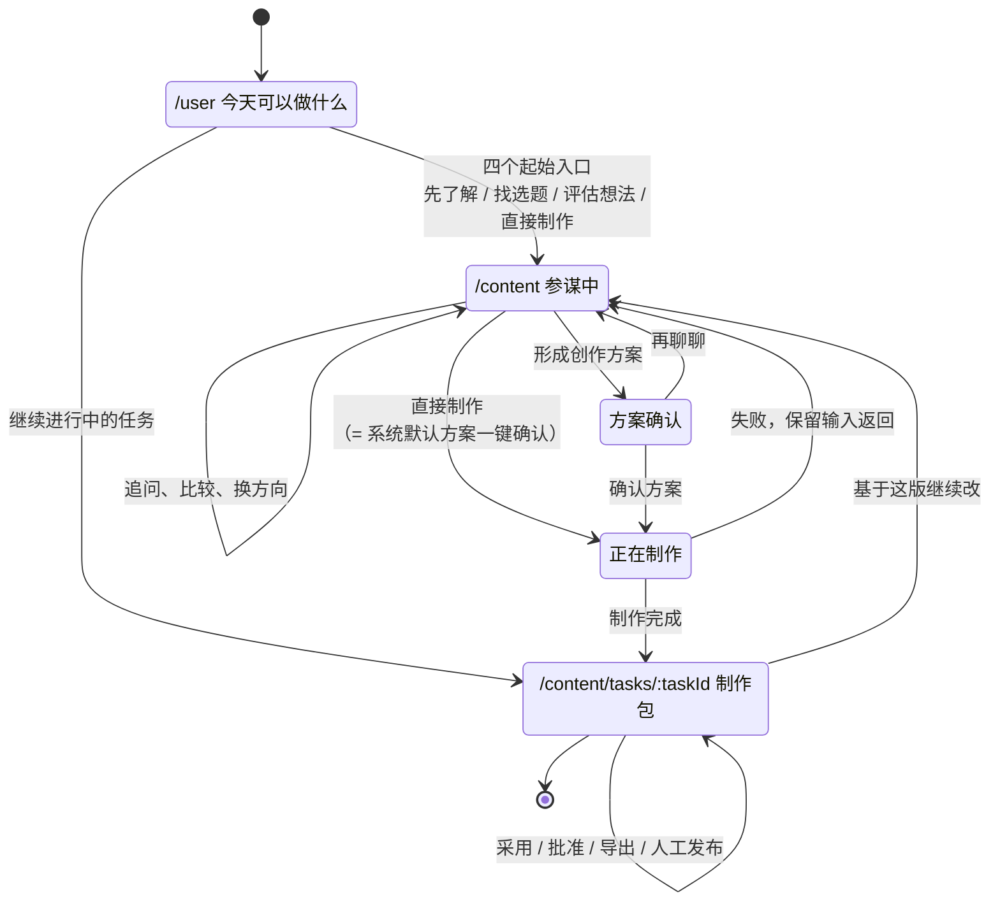
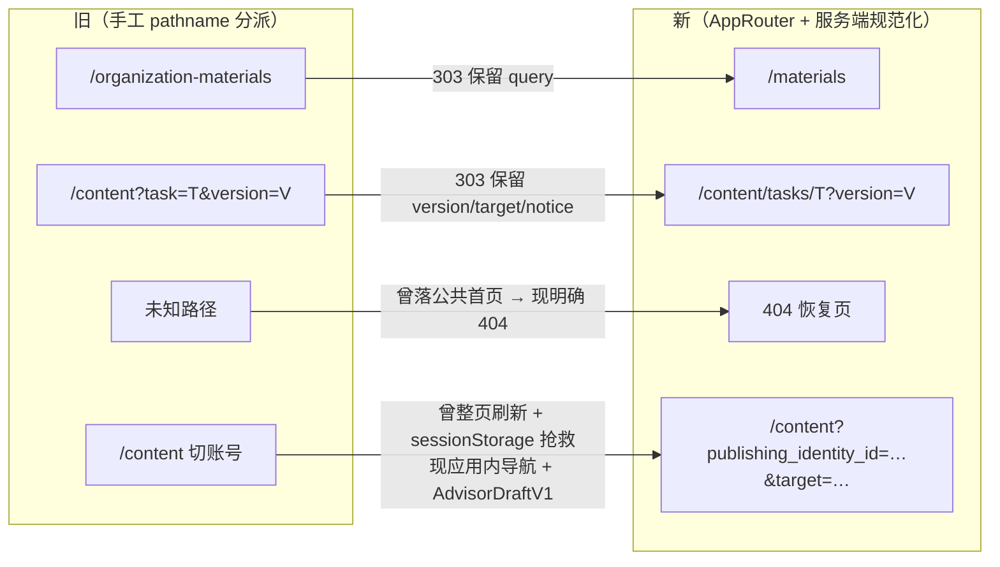
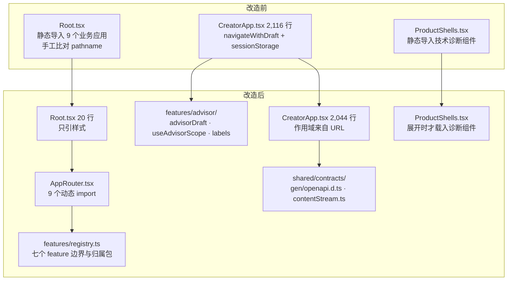

# FE-00 · 页面状态图与新旧迁移图

## 一、创作主链状态机

用户决策顺序，不是后端调用顺序。四个阶段，每个阶段最多一个实心主动作。



顶部阶段条恒定显示，只作状态提示：

```text
参谋中  →  方案确认  →  正在制作  →  制作包
```

### 阶段与 URL 的对应

| 阶段 | URL | 本包状态 |
|---|---|---|
| today | `/user` | 路由已建；工作台界面属 EXE-03 |
| advisor | `/content?publishing_identity_id=…&target=…` | 路由已建，作用域进 URL，切换不整页刷新 |
| proposal | `/content` 内阶段（不另立路由） | 界面属 EXE-06 |
| producing | `/content` 内阶段（不另立路由） | 界面属 EXE-06/07 |
| package | `/content/tasks/:taskId?version=N` | 路由已建；制作包页面属 EXE-07 |

proposal 与 producing **刻意不占独立路由**：它们是同一工作区里的阶段，
给它们独立 URL 会让"后退"退到一个无法重建的中间态。

## 二、异常与边界态

每个态都必须有下一动作，不留死胡同。

| 态 | 触发 | 界面必须做到 | 原型锚点 |
|---|---|---|---|
| 空态 | 新账号、无历史 | 保留四个起始入口，不造假数据 | `#fe00-empty` |
| 加载 | 工作区拉取中 | 骨架占位，阶段条已可见 | `#fe00-loading` |
| 失败 | 生成失败 / 流违约 | **保留输入**，给出可重试动作与人话原因 | `#fe00-failure` |
| 跨账号 | 切换发布账号 | 不显示原账号文本；切回恢复原稿 | `#fe00-cross-account` |
| 资料缺口 | 品牌资料不足 | 说明缺什么、由谁补、去哪补 | `#fe00-gap` |
| 旧成品兼容 | V5 及更早版本 | 原样只读呈现，不假装有结构化制作包 | `#fe00-legacy` |

## 三、新旧路由迁移图



逐行可执行契约见 [`scripts/exe01/legacy_routes.json`](../../../scripts/exe01/legacy_routes.json)，
由 `scripts/exe01/assert_route_compatibility.py` 对真实应用复跑。

## 四、组件迁移图



| 旧位置 | 新位置 | 性质 |
|---|---|---|
| `Root.tsx` 手工路由（旧 60–93 行） | `app/AppRouter.tsx` | 替换 |
| `Root.tsx` 未知路径 `return <PublicHome />` | `app/NotFoundPage.tsx` | 语义修正 |
| `CreatorApp.tsx` `navigateWithDraft` + 两个 sessionStorage effect | `features/advisor/advisorDraft.ts` + `useAdvisorScope.ts` | 替换（机制退役） |
| `CreatorApp.tsx` `STAGE_LABELS` / `FAILURE_STAGE_LABELS` / `targetMetadata` / `normalizedIdentities` / `humanDate` | `features/advisor/labels.ts` | 平移（行为不变） |
| `CreatorApp.tsx` `contentLocation` / `draftStorageKey` | 删除（作用域改由 URL 承载） | 退役 |
| `ProductShells.tsx` 静态 `CapabilityGuide` | 同文件内 `lazy()` + 展开触发 | 加载时机改变 |
| 手写流事件类型消费 | `shared/contracts/contentStream.ts` 运行时校验 | 增强 |
| 手写 API 类型（新合同） | `shared/contracts/gen/openapi.d.ts` | 生成 |

**未迁移、刻意保留**：存量 63 处手写 API 类型（UX-04R FE-02「不强迁」）；
`CreatorApp.tsx:157-174` 与 `DisplayApp.tsx:41-56` 的正则猜结构渲染
（退役对象属 EXE-07）；`TenantAdminApp.tsx` 全文（本包零改动）。
