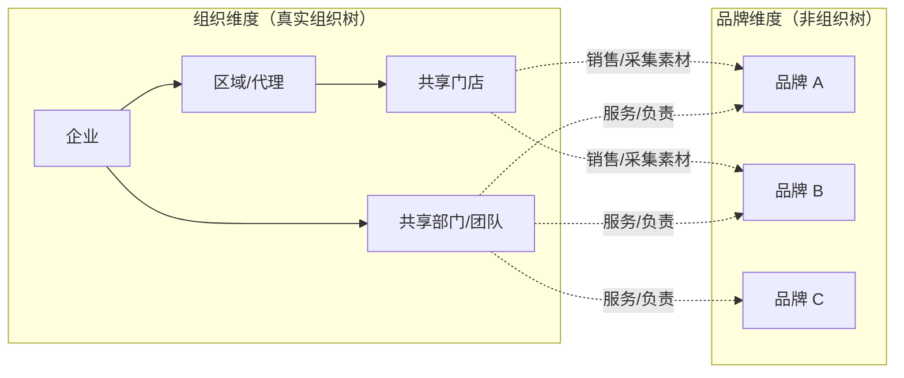
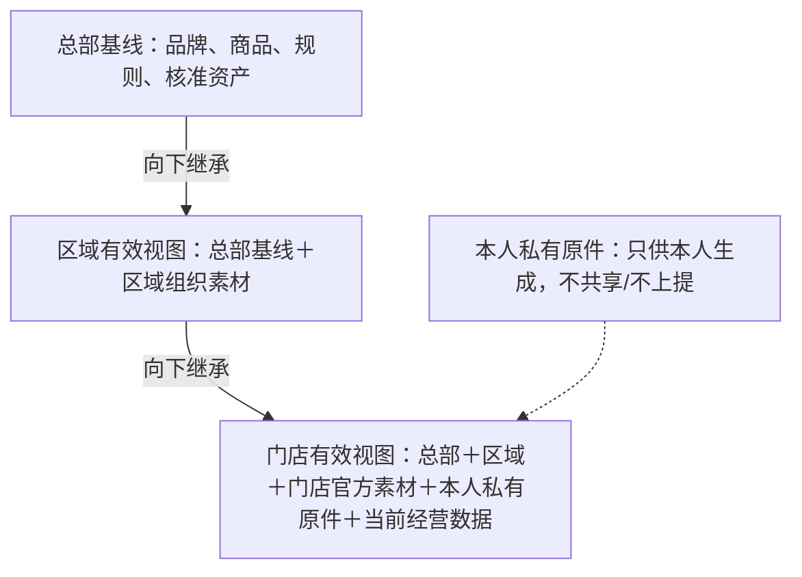

# 2026-07-17 品牌经营画像与三级素材工作区

> **2026-07-21 后续定稿：**本文原“四级品牌语义成熟度”属于早期候选，现已由 [ADR-016](../架构决策/ADR-016-ERP品牌码与独立内容品牌极简门槛.md) 取代。第一版不建设 0—3 级状态机，只以企业是否确认该品牌独立的 D-014 内容战略基线作为独立内容身份门槛。

## 总判断

用户指出原先三类品牌粒度过粗，这一判断成立；但修正方法不是继续扩充成十几个互斥的品牌类别。

用户列举的对象处在不同层级：江南布衣、安踏体育、安正时尚可能指企业集团；速写、FILA、玖姿、尹默、ANZHENG 安正是集团旗下品牌；三级代理加盟、散货批发是渠道或货品模式；亲子是受众/场景；集合店和设计师买手店是零售业态。它们不能放在同一棵分类树中比较。

正确方法是：

> 先区分“谁在经营”，再用多个会改变系统行为的维度描述其经营画像；画像可以组合、变化并带生效时间。

## 一、六维经营画像

| 维度 | 最小取值示例 | 决定的系统行为 |
|---|---|---|
| 主体身份 | 单一法人单品牌、单一法人多品牌、集团多法人多品牌、品牌运营商、区域代理、加盟门店、零售招牌、批发商、散货商户 | 谁是租户、知识所有者、数据控制者和审批人 |
| 品牌与商品来源 | 自有设计品牌、正式授权经营、贴牌/OEM/ODM、第三方品牌选品、多品牌买货、无稳定品牌散货、混合 | 谁能提供品牌与商品真相，是否有权使用商标和品牌素材 |
| 货权与交易关系 | 总部持货直营、经销买断、加盟买断、代销/联营、买手店自采、档口现货 | 库存、价格、促销、退换和滞销责任由谁维护 |
| 渠道拓扑 | 直营、直营＋经销、总部→区域代理→加盟终端、批发市场→零售商、多品牌集合/买手店、线上混合 | 数据作用域、素材流转、审核和发布路径 |
| 定位与商品节奏 | 大众功能、高端运动时尚、设计审美、成熟商务、家庭/童装、快速潮流、策展零售；季节企划/常青/快反/现货 | 内容证据强度、趋势依赖、更新频率和内容产品组合 |
| 治理与内容能力 | 总部/区域/门店的表达、选品、价格、库存和顾客关系权力；数据及内容能力 0—3 级 | 哪一层可以新增、改写、审核和发布，哪些环节需要平台辅助 |

价格带、年龄、性别、风格等仍是重要品牌属性，但不能单独决定组织权限和工作流；只有会改变数据、权限、内容产品、审核或评测的维度，才进入经营画像核心。

经营画像附着在现有“组织主体”和“品牌”对象上，并带版本、生效时间和证据，不新增一套品牌本体。

### 共享组织的单一企业多品牌如何兼容

用户进一步明确：有些服装企业虽然经营多个品牌，但组织架构完全没有按品牌拆分，同一套商品、运营、渠道和门店团队服务所有品牌，品牌只在 ERP 品牌码和商品资料上区分。

这种情况不能画成“企业部门下面有品牌 A、B、C”。正确模型是两条彼此正交的维度：

这仍然是一个租户、一套用户账号、一棵真实组织树和一个数据底座。品牌不是虚构部门，而是商品、知识、素材、任务和内容的作用域维度。

这里也修正了“一个品牌一个租户”的默认假设：租户首先是签约、数据控制和隔离边界。共享组织的多品牌服装企业通常是一个企业租户包含多个品牌作用域；只有合同、数据控制或隔离责任确实独立时，才考虑拆分租户。

系统需要显式支持：

- 企业 `拥有/运营` 多个品牌；
- 同一团队或人员 `负责` 一个、多个或全部品牌，无需复制账号或岗位；
- 同一区域代理和门店 `经营` 一个或多个品牌；
- ERP `brand_code` 映射为品牌实体，并保存源系统、版本和生效期；
- 商品通常关联一个主品牌，联名商品用“主品牌/合作品牌/授权方”等关系表达；
- 门店素材可以标记为企业/门店共享，也可以关联某个品牌或具体商品，不能全部默认归某品牌。

多品牌门店生成某一品牌内容时，有效视图是：

> 企业共享基线 + 当前选定品牌知识 + 当前区域语境 + 门店共享事实 + 该品牌在本店的商品、素材和经营数据。

系统不得因为品牌 A、B 属于同一公司，就自动把 A 的声纹、顾客素材、代言资产或成功内容方法用于 B。若品牌向任务没有明确品牌，应阻止生成并要求选择；企业级活动或真正跨品牌内容则必须显式选择多个品牌并分别核验权利与规则。

内容产品采用“企业定义、品牌配置”：企业可定义共同的内容产品合同，各品牌在具备相应资料时分别配置证据策略、声纹、受众、渠道和评测；企业还可以维护跨品牌内容日历，避免内部品牌彼此重复或争夺同一受众。

### ERP 品牌码不等于独立品牌人格

必须直接纠正一个容易发生的错误：ERP 中存在多个品牌码，只证明商品被分组，不证明这些品牌已经拥有独立的市场定位、内容声纹和治理能力。如果系统直接为每个品牌生成不同“人格”，很可能是在制造没有企业依据的伪品牌知识。

第一版采用一道极简业务门：

| 当前情况 | 系统允许的行为 |
|---|---|
| 只有 ERP 品牌码和商品归属 | 只用于商品检索/过滤，内容沿用企业共同表达；禁止凭空生成品牌定位、故事、人格和声纹 |
| 企业已确认该品牌独立的 D-014 内容战略基线 | 取得独立内容品牌身份，可以按该基线编译品牌内容和后续账号矩阵 |

组织架构是否按品牌拆分不构成门槛；同一套组织可以服务多个独立内容品牌。模型推断、商品差异、Logo、账号名称和高表现内容都不能自动完成升级。

## 二、用户样本如何放入画像

### 1. 江南布衣集团、JNBY 与速写

这是“集团—品牌”双层结构，不是两个完全独立的企业类型。公开披露显示集团同时经营 JNBY、CROQUIS 速写等品牌，并同时存在自营店、经销商店、线上渠道和“江南布衣+”多品牌集合店。因此可以共享集团级组织、合规和部分供应链能力，但 JNBY 与速写必须拥有各自的品牌表达档案、受众、商品事实和内容组合。

参考：江南布衣 2025/26 中期报告：https://www1.hkexnews.hk/listedco/listconews/sehk/2026/0316/2026031600647.pdf

### 2. 安正时尚集团、玖姿、尹默与 ANZHENG 安正

这是一个集团下的多品牌组合。玖姿、尹默和 ANZHENG 安正在定位、客群以及直营/加盟结构上并不相同，不能因为同属中高端时装就共用同一个渠道与内容画像。“安正”还必须明确是安正时尚集团，还是 ANZHENG 男装品牌。

参考：安正时尚集团官方简介：https://www.anzhenggroup.com/index.php/Wap/about

### 3. 安踏体育、ANTA 与 FILA

安踏体育公开将集团划分为专业运动、时尚运动和户外运动品牌群，并明确 ANTA 面向大众专业运动、FILA 面向高端时尚运动。它们可以共享集团中台能力，但商品证据、内容定位、渠道治理和品牌表达不能合并。

参考：安踏体育多品牌战略：https://ir.anta.com/sc/news_detail.php?id=126812

### 4. 自有品牌且三级渠道完整的批发型企业

这是本项目最值得验证的经营画像之一，但“三级渠道完整”不等于知识条件成熟。仍须核验品牌/IP 权利、商品资料稳定性、总部是否有权约束代理和门店内容，以及加盟主体是否同意门店素材向上复用。

### 5. 纯散货与市场潮流货

这类主体可能没有稳定品牌真相，核心应转为商户、供应来源、货品批次、可观察属性、选品集合、短期趋势和有效期。系统可以帮助表达选品能力、穿搭场景和本地服务，但不能凭空生成品牌历史、设计理念、功能效果或供应链故事。

### 6. 潮流亲子经营者

“亲子”是受众与生活场景，不是经营类型。必须先判定它是自有品牌、授权/贴牌、批发散货还是多品牌零售，再叠加家庭关系、成长阶段和亲子活动等内容标签。涉及不满十四周岁未成年人真人资料时，进入敏感个人信息治理，不应由普通门店采集流程直接处理。

参考：《中华人民共和国个人信息保护法》：https://www.npc.gov.cn/npc/c2/c30834/202108/t20210820_313088.html

### 7. 集合店与设计师买手店

这不是普通单品牌门店。必须同时表达“零售招牌/策展者”和“多个上游品牌”：门店可以拥有自己的策展声音和本地生活素材，但商品事实、商标和品牌媒体权利仍分别来自上游品牌或供应商。

## 三、“总部一次构建、定期维护”只对部分数据成立

| 数据层 | 例子 | 正确更新方式 |
|---|---|---|
| 慢变品牌核心 | 品牌历史、价值判断、组织、角色、合规红线 | 首次基线构建；季度复核或事件触发更新 |
| 商品与企划 | 款式、成分、版型、洗护、系列、上市计划 | 每季/每批/每次上市同步，旧版本保留有效期 |
| 媒体资产与权利 | 图片、视频、音乐、肖像、声音、渠道许可 | 持续新增；到期、撤回或用途变化立即更新 |
| 区域/门店生活 | 商圈、人物、服务片段、顾客问题主题、本地事件 | 持续轻采集，按时效自动提醒复核或失效 |
| 动态经营事实 | 库存、价格、活动、营业时间、天气 | 从权威系统读取或短期缓存；必须带时间戳和失效期 |
| 趋势与反馈 | 平台形式、热点、内容表现、门店反馈 | 持续观测；默认衰减，不自动升级为长期知识 |

因此，品牌专属知识工程是“先构建稳定基线，再按不同节奏持续供给”，不是“项目建库完成后偶尔维护”。

## 四、每个门店需要自己的工作区，不需要自己的物理数据库

推荐结构是“一套租户数据底座 + 多级逻辑作用域”：

门店在界面上看到的是“我的素材库/知识空间”，底层由总部有效内容、区域官方内容、门店官方内容、当前登录者的 `creator_private` 原件和动态数据即时组合。同店其他账号看不到该登录者私有原件。首期两类素材入口不互转，不提供私人素材共享、上提或跨层级复用。

继承不是任意覆盖：

- 品牌红线、商品权威事实和合规规则：门店只能引用或提交纠错，不能覆盖。
- 区域气候、节庆、商圈和地方表达：区域可以新增，辖区门店继承。
- 门店人物、现场故事和服务记录：个人采集原件仅上传者本人可见，首期不支持协作、共享、上提或跨层级复用。
- 库存、价格和活动：只服从指定权威源与最新有效时间，不能按“最后手工编辑者优先”。
- 冲突必须显式提示，禁止静默合并。

每项记录至少保存：`租户、组织作用域、贡献者、来源、时间地点、状态、版本、有效期、可见范围、授权状态、审核人`。

## 五、门店负责捕捉真实，区域负责整理，不应由区域全量转录

区域代理具备培训和整理能力是重要优势，但如果所有门店资料都先交区域人工汇总，再交总部录入，随着门店数量增长会形成四个问题：时效丢失、二次转述失真、审核积压和权利来源模糊。

推荐流程：

1. 总部或区域发布具体采集任务，例如“记录本周三个换季叠穿真实问题”，而不是要求门店泛泛上传素材。
2. 店员通过手机在 30—60 秒内上传照片、短视频、语音或一句观察到本人私有原始素材箱；系统仅在该用户主动发起任务时处理并建议门店、时间、转写、商品识别和标签。
3. 使用者确认发生了什么、是否涉及人物，并只在本人任务中使用；不要求理解本体或填写长表。
4. 系统在本人主动发起任务时检查必填字段、重复、时效和高风险信号；区域内容管理员通过方法培训赋能，不能进入、抽检或整理个人私有原件箱。
5. 总部只管理总部和组织官方素材，不审核、接收或复用个人私有原件。
6. 门店上传后应立即获得本店可编辑内容草稿或其他直接收益；若门店只供数而收益全部归总部，机制难以持续。

## 六、素材储备不是一个文件夹

一次门店现场至少可能产生五种彼此独立的对象：

1. 原始观察记录：谁、何时、何地、发生了什么；
2. 媒体资产：照片、视频、语音及其原文件；
3. 结构化知识陈述：从记录中确认出的事实或候选洞察；
4. 权利许可：人物、声音、版权、可用渠道、期限和撤回状态；
5. 动态经营上下文：当时库存、价格、活动、天气和营业状态。

典型状态流是：

`个人私有原件 → 本人生成使用 → 编辑/删除/到期清理`；生成的业务内容进入对应经营主体的 `ContentItem` 与审计链，但原件不转入组织素材库。

门店上传的“顾客最近都在问宽松版型”首先只是观察记录；只有样本、范围和审核满足条件后，才可能成为区域经营洞察，不能直接成为品牌或行业事实。

## 七、第一阶段建议边界

首个完整试点建议只选择一个具有稳定自有或完整授权品牌、商品主数据、总部治理能力和真实区域/加盟网络的企业，验证一个总部、两个区域和少量门店的完整闭环。

多企业多样性不靠同时开发五套系统证明，而采用两层验证：

- 需求层：用“多品牌集团、直营/加盟差异集团、大型多品牌运动集团、三级代理加盟品牌、散货/买手零售”五种经营画像检查语义模型和内容产品覆盖。
- 运行层：只让一个授权品牌进入完整数据采集与门店闭环，避免首期范围失控。

首期暂不包括：纯散货完整业务、买手店多品牌权利编排、门店自行采集顾客真人或儿童素材、每店独立数据库、区域全量人工转录、总部全量审批和跨租户素材共享。

首期核心验收应包括：

- 门店能否在一分钟内完成一次合格采集；
- 本店内容能否使用本地真实素材，而绝不泄漏其他门店私有素材；
- 撤权、过期素材和过期经营数据能否立即停止进入新内容；
- 私有原件能否始终只供本人使用，且不会被同店、区域或总部检索、共享或上提；
- 没有本地素材时系统是否诚实降级，而不是虚构本地故事。

## 八、当前决策状态

- D-013—D-015：用户对原则基本同意，记为原则确认。
- D-016：24 类最小语义模型暂不冻结，先决定是否把散货和买手店纳入首期。
- 新增 D-017：六维经营画像。
- 新增 D-018：总部/区域/门店逻辑素材工作区与持续供给流程。
- 新增 D-019：首期经营模式边界。
- 新增 D-020：亲子业态真人儿童素材首期边界。
- 新增 D-021：ERP 品牌码与独立内容品牌之间的语义成熟度门槛。

## 九、后续状态更新

- 上文“一个总部、两个区域和少量门店”是当时建议，已被 2026-07-17 的用户确认替代。首期正式试点现为：**一个单品牌企业/总部 + 一个区域代理 + 3—5 家加盟终端门店**；其他暂不纳入首期试点。D-019 已关闭。
- D-016 现为 25 类候选，新增陈列模块私有的 `DisplayArtifact`；具体类名、关系和必填属性仍待首期业务合同反推后冻结。
