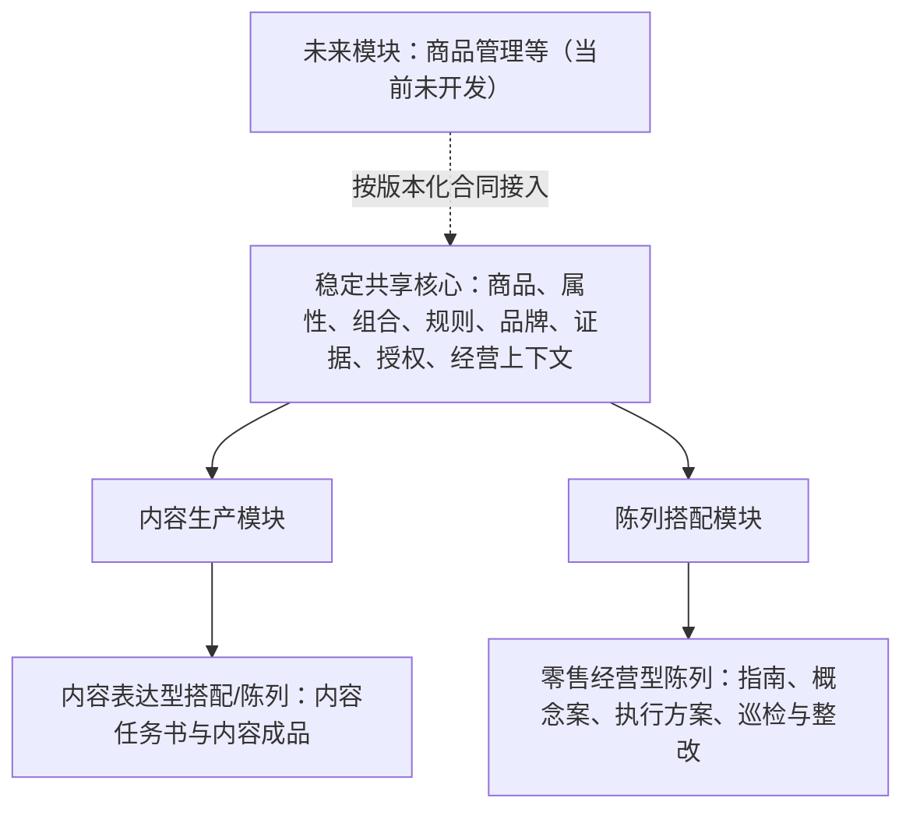

# 2026-07-17 双应用陈列语义与可扩展模块框架

## 总判断

用户提出的歧义必须在第一版语义模型中解决。系统第一版计划开发并启用两个应用：

1. 内容生产；
2. 陈列搭配。

“内容生产中的陈列搭配”是内容生产应用内部调用的创意表达能力；“面向企业组织和渠道的陈列搭配”是独立的零售经营应用。两者可以共享商品、颜色、版型、搭配关系和品牌审美知识，但不能共享同一套真实性、可执行性、状态和验收合同。

同时，两个应用只是第一版启用范围，不是系统永久上限。未来可以增加商品管理等模块，但不能为尚未定义的应用预建万能对象和空壳功能。

## 一、两个应用边界，而不是两套知识库

共享核心只保存两个当前模块含义一致、均有真实数据源的对象；应用特有的任务、产物和状态留在各自模块中。

## 二、正式语义名称

### A. 内容表达型搭配/陈列

所属应用：内容生产。

目的：拍摄、图文、短视频、直播脚本、视觉叙事和场景表达。

允许：

- 创意选品与组合；
- 理想化构图、背景、镜头、人物关系和情绪；
- 明确的虚构情境、摆拍再现或 AI 视觉演绎；
- 不受当前某家门店库存约束的概念表达，前提是不声称门店当前可售或正在如此陈列。

仍须真实：商品属性、品牌身份、功能宣称、价格/库存声明、真人经历以及媒体和人物授权。

主要对象：`ContentBrief`、`ContentItem`，并强制标记：

- `actuality = concept / staged / actual`；
- 是否作出门店现状、可售库存或经营结果声明；
- 使用了哪些真实商品、品牌资产和授权素材。

### B. 零售经营型陈列

所属应用：陈列搭配。

目的：企业内部培训、渠道指导、门店方案、库存适配、巡检和整改闭环。

它可以有创意，但创意必须位于真实经营约束之内。未实施的新方案不是虚构；把它描述成已经发生的门店事实才是失真。

对内并非绝对禁止模拟：培训可以使用错误示例、合成案例和方案预演，但必须标记为“教学示例/模拟”，不能被系统误判为当前门店状态或直接下发执行。

## 三、陈列搭配模块的五类业务产物

新增模块私有上位类：`DisplayArtifact / 陈列业务产物`。

| 子类型 | 中文名称 | 真实性与可执行性 |
|---|---|---|
| `training_guide` | 陈列培训/指导 | 可以使用明确标注的教学示例；不直接代表某门店当前状态 |
| `retail_concept` | 经营陈列概念案 | 是尚未实施的建议；真实门店、商品和设施不得虚构，未知项必须列为假设；尚不可直接执行 |
| `execution_plan` | 门店陈列执行方案 | 绑定指定门店、空间、SKU、数量、库存时间和规则；审批后且数据有效时才可执行 |
| `inspection` | 陈列巡检记录 | 记录带门店、时间、采集人和原始证据的现场观察；观察事实与评价分开 |
| `remediation` | 陈列整改任务 | 来自已确认问题，记录责任人、期限、措施、复核证据和闭环状态 |

内容成品即使描绘了一个漂亮的陈列场景，也不能反向成为门店执行方案或现场事实证据；经营概念案可以被内容生产引用为创意来源，但仍须转成内容任务并遵守内容侧规则。

## 四、“创意、演绎、预演、建议、实况”必须分开

- **创意**：在允许范围内提出新的组合、主题、节奏、焦点和表达方法；两个应用都允许。
- **演绎**：为传播而进行的摆拍、虚构情境或理想化视觉呈现；主要属于内容生产。
- **预演/模拟**：为了培训或评审展示可能结果；经营侧允许，但必须标记为模拟且不可直接执行。
- **经营建议**：基于已知规则和部分真实条件提出的方案；尚未实施，不是门店实况。
- **已执行/已核验实况**：必须有门店确认、时间、版本、现场证据和必要的专业审核。

所有相关输出统一使用五级事实/执行状态：

1. 灵感概念；
2. 模拟方案；
3. 待审批方案；
4. 已批准执行方案；
5. 现场已验证结果。

生命周期状态、真实性状态、库存有效状态和授权状态必须分开保存，不能用一个“已完成”同时代表四件事。

## 五、关联对象与关键关系

- `ProductComposition` 保持为中性的商品组合，只表达成员、角色、顺序、数量、替代关系和条件；它本身不能证明组合已经在门店陈列。
- 陈列模块的 `DisplayContext` 描述空间、区域、货架、容量、动线目标和适用时段；明确区分内容拍摄场景与真实零售空间。
- `OperationalContext` 保存库存、价格、活动等带来源、时间戳和有效期的动态事实。
- `MediaAsset` 与 `EvidenceRecord` 保存内容素材和巡检证据；巡检评价不能覆盖原始观察。
- `EvaluationSignal` 评价内容质量、方案可执行性或巡检偏差，不代替原始记录。

主要关系：

- 内容成品 `描绘` 商品组合；
- 陈列业务产物 `使用` 商品组合并 `适用于` 陈列情境；
- 经营概念案 `转换为` 某门店执行方案；
- 执行方案 `依据` 经营上下文并 `受约束于` 品牌/安全/空间规则；
- 巡检记录 `观察` 门店实况并 `对比` 指南、概念案或执行方案；
- 巡检记录 `产生` 评测信号和整改任务；
- 现场证据 `验证` 执行结果，但只覆盖其实际拍摄范围。

## 六、基于库存的陈列不是让 LLM 自由画图

正确问题是一个受约束的候选方案求解：

`品牌陈列规则 + 门店空间/货架容量 + 当前可用商品 + 库存状态 + 活动目标 + 搭配关系 → 主方案 + 缺货替代方案 + 风险和未满足约束`

“实时库存”必须定义：

- 权威系统和门店；
- SKU 与库存口径；
- 在手、可售、预留、残次、在途和陈列样等状态如何使用；
- 数据 `as-of` 时间；
- 可接受的新鲜度和方案有效期；
- 库存变化后的失效或重算触发条件。

库存不写入长期知识库或文档向量索引；在生成执行方案时运行时读取，最多保存带时间戳的快照作为审计证据。

空间尺寸不完整、库存过期、关键商品缺失或品牌硬约束冲突时，系统必须把结果降为“模拟方案/不可执行”，不得标记为可下发方案。

## 七、替代督导和陈列专员的现实边界

系统适合替代或压缩：

- 标准资料整理和门店问答；
- 总部规则向门店任务的转译；
- 初步商品组合与缺货备选；
- 标准角度照片的可见问题预筛；
- 整改任务、期限和复核跟踪；
- 大量门店的风险排序和异常升级。

首期不能替代：

- 季度视觉方向和重大创意决策；
- 未被数据/照片覆盖的空间、灯光、材质、稳定性和顾客动线判断；
- 安全、复杂门店例外及加盟商冲突处理；
- 培训、说服和推动人员执行；
- 对最终下发与高风险整改承担责任。

更准确的产品目标是“扩大陈列专业人员的管理半径，并替代重复性远程工作”，不是消灭陈列岗位。

## 八、首期最小闭环

只选择一种标准货架或一个橱窗区域、一次明确活动和少量试点门店：

1. 专业人员建立品牌规则、商品资料、正反案例和硬约束；
2. 门店按统一清单提交空间尺寸、基线照片和库存快照；
3. 系统做完整性检查，不足则只给模拟方案；
4. 系统给一个主方案、一个缺货备选及其依据、假设和风险；
5. 区域督导/陈列专员审批后下发；
6. 门店执行并以统一角度上传照片；
7. 系统只对可见项做疑似问题预检并创建整改候选；
8. 专业人员确认异常，高风险和最终完成状态保留人工签字；
9. 整改后复核闭环；反馈先进入候选经验区，不能因一次销售变化自动升级为规则。

验收重点是可执行性、数据不足时是否诚实降级、私有门店数据隔离、照片初筛节省的工作量和整改闭环，不是效果图是否漂亮，也不能把销售相关性直接当作陈列的因果证明。

## 九、顶层应用可扩展，但当前不为空想买单

采用：

> 稳定共享核心 + 可注册应用模块 + 版本化输入/输出合同。

第一版计划实现并注册的模块：

- `content-production`；
- `display-merchandising`。

每个已实现模块声明：模块标识、合同版本、输入/输出类型、依赖的共享对象、权限、状态机、事件以及迁移规则。

未来商品管理等应用在未立项和开发前只存在于路线图中：不预建空表、空接口、空菜单、后台任务或万能 JSON 载荷；真正开发时通过新模块合同接入共享核心。商品和库存作为当前两个模块的只读输入，不等于已经开发了商品管理应用。

术语边界：

- **前向可扩展**：以后可以增加新模块、可选字段或子类型；旧模块对未知扩展能安全忽略或拒绝，不被破坏。
- **向后兼容**：新版本仍能读取旧数据、执行旧合同，旧客户端在承诺范围内继续工作。

未知未来需求不可能提前保证完整兼容；可以保证的是稳定标识、模块隔离、版本化合同、加法优先和明确迁移机制。

`DisplayArtifact` 属于陈列模块，不进入稳定共享核心。运行时模块注册表只登记已经实现的模块；未来应用只保留路线图和命名空间，不以“默认关闭”的方式部署未完成代码。

## 十、对第一版最小语义模型的修订建议

第一版总语义模型候选由 24 类增加为 25 类，仍在用户接受的 15—25 范围内：

- 原有 `ContentBrief` 与 `ContentItem` 继续只服务内容生产；
- 新增 `DisplayArtifact`，只属于陈列搭配模块；
- `ProductComposition`、商品、品牌、规则、证据、授权和经营上下文作为共享对象；
- 培训指南、经营概念案、执行方案、巡检记录和整改任务是 `DisplayArtifact` 子类型，不增加五个一级类别；
- 应用模块注册表属于技术元数据，不计入领域语义类别。

## 十一、必须回答的业务问题

1. 当前任务属于内容生产还是零售经营陈列？
2. 这张图是内容演绎、教学模拟、经营建议、执行方案还是现场实况？
3. 哪些创意维度自由，哪些商品、空间、库存和品牌规则已锁定？
4. 经营概念案还缺哪些条件才能转成门店执行方案？
5. 当前库存来自哪里、是什么口径、何时读取、何时过期？
6. 库存或空间变化后，哪些方案自动失效，哪些可重新求解？
7. 培训指导适用于哪些店型、商品、季节和人员，有什么例外？
8. 巡检记录中的观察、证据、判断和整改能否分别追溯？
9. “已下发、已执行、已核验”能否被系统严格区分？
10. 内容生产能否引用经营陈列创意，却不把它包装成真实门店状态？
11. 当前模块关闭时，另一个模块是否仍能独立工作？
12. 新增未来应用时，是否无需改变现有模块字段含义和历史数据？

## 十二、当前决策状态

- **D-022 已于 2026-07-17 共同确认并关闭**，正式决策见 `docs/架构决策/ADR-002-双应用陈列语义边界.md`。
- **D-024 已于 2026-07-17 共同确认并关闭**，正式决策见 `docs/架构决策/ADR-003-可扩展应用模块与版本兼容.md`。
- **D-023 后续已关闭**：本轮当时要求等待试点 ERP/POS 资料且不得凭空承诺“实时”；用户随后明确 ERP/POS 接入不是系统阻塞项，最终改为供应商无关快照合同与按事实可用性降级，见 [ADR-007](../架构决策/ADR-007-外部经营系统可选接入与库存事实降级.md)。
- D-005 仍待决定陈列搭配首期闭环深度。
- D-016 的 25 类候选结构及模块归属已可稳定；具体类名、关系和必填属性待首期业务合同反推后冻结，不依赖任何具体 ERP/POS 字段。
